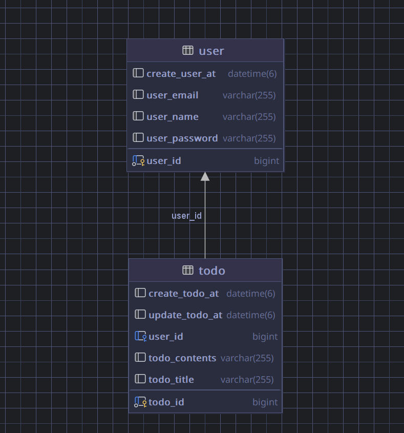

이 코드는 간단한 일정 생성 조회 수정 삭제 기능을 가지고 있습니다

일정 API

- 이름:일정 생성
- Method: POST
- URL: /todos

Request Body:

``
{
"todoTitle": "과제를 해야해",
"todoContents": "내일 2시까지라니 오마이갓"
}
``

- 이름: 일정 조회
- Method: GET
- URL: /todos/{postId}

Request Body: 

``
없음
``

- 이름: 일정 수정
- Method: PATCH
- URL: /todos/{postId}

Request Body:
``
{
"todoTitle": "수정할 제목목",
"todoContents": "수정할 내 용용"
}
``

- 이름: 일정 삭제
- Method: DELETE
- URL: todos/{postId}

Request Body:

``
없음
``

유저 API

- 이름: 회원 가입
- Method: POST
- URL: /users/signup

Request Body:

``
{
    "email": "이메일",
    "password": "비밀번호",
    "userName": "유저 이름"
}
``

- 이름: 회원 조회
- Method: GET
- URL: /users/{userId}

Request Body:

``
없음
``

- 이름: 회원 수정
- Method: PATCH
- URL: /users/{userId}

Request Body:
``
{
 "userName": "변경할 이름"
}
``

- 이름: 회원 탈퇴
- Method: DELETE
- URL: /users/{userID}

Request Body:

{
"userPassword": "유저 비밀번호"
}

ERD

